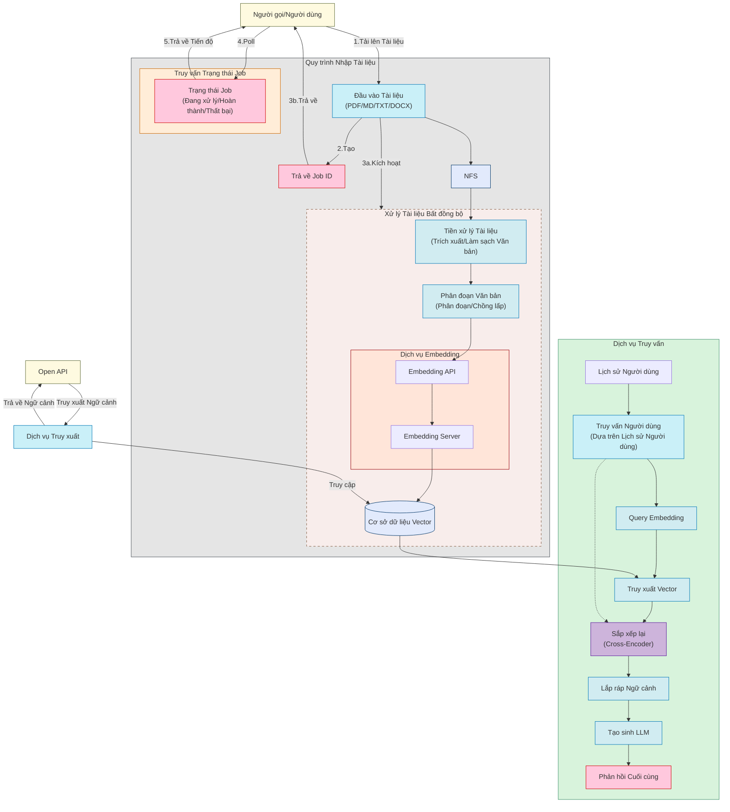

<div align="center">
  
  <br />
  <p>
    <strong>Quản lý cơ sở tri thức dựa trên RAG (Retrieval-Augmented Generation)</strong>
  </p>

  <p>
    <a href="https://github.com/rag-web-ui/rag-web-ui/blob/main/LICENSE"></a>
    <a href="#"></a>
    <a href="#"></a>
    <a href="#"></a>
    <a href="#"></a>
  </p>

  <p>
    <a href="#tính-năng">Tính năng</a> •
    <a href="#bắt-đầu-nhanh">Bắt đầu nhanh</a> •
    <a href="#hướng-dẫn-triển-khai">Hướng dẫn triển khai</a> •
    <a href="#kiến-trúc-kỹ-thuật">Kiến trúc kỹ thuật</a> •
    <a href="#hướng-dẫn-phát-triển">Hướng dẫn phát triển</a> •
    <a href="#hướng-dẫn-đóng-góp">Hướng dẫn đóng góp</a>
  </p>

  <h4>
    <a href="README.md">English</a> |
    <a href="README.zh-CN.md">简体中文</a> |
    <span>Tiếng Việt</span>
  </h4>
</div>

## 📖 Giới thiệu

RAG Web UI là một hệ thống đối thoại thông minh dựa trên công nghệ RAG (Retrieval-Augmented Generation), giúp xây dựng hệ thống hỏi đáp thông minh dựa trên cơ sở tri thức riêng. Thông qua việc kết hợp truy xuất tài liệu và mô hình ngôn ngữ lớn, hệ thống cung cấp dịch vụ hỏi đáp tri thức chính xác và đáng tin cậy.

Hệ thống hỗ trợ nhiều cách triển khai mô hình ngôn ngữ lớn, có thể sử dụng các dịch vụ đám mây như OpenAI, DeepSeek, cũng như hỗ trợ triển khai mô hình cục bộ thông qua Ollama, đáp ứng nhu cầu về quyền riêng tư và chi phí trong các tình huống khác nhau.

Đồng thời cung cấp giao diện OpenAPI, thuận tiện cho người dùng gọi cơ sở tri thức thông qua API.

Bạn có thể tìm hiểu quy trình thực hiện của toàn bộ dự án thông qua [Hướng dẫn RAG](./docs/tutorial/README.md).

## ✨ Tính năng
- 📚 **Quản lý tài liệu thông minh**
  - Hỗ trợ nhiều định dạng tài liệu (PDF, DOCX, Markdown, Text)
  - Tự động phân đoạn và vector hóa tài liệu
  - Hỗ trợ xử lý tài liệu bất đồng bộ và tăng trưởng

- 🤖 **Công cụ đối thoại tiên tiến**
  - Truy xuất và tạo sinh chính xác dựa trên RAG
  - Hỗ trợ đối thoại đa vòng có ngữ cảnh
  - Hỗ trợ xem văn bản gốc thông qua chỉ số tham chiếu trong đối thoại

- 🎯 **Kiến trúc hợp lý**
  - Thiết kế tách biệt frontend và backend
  - Lưu trữ tệp phân tán
  - Cơ sở dữ liệu vector hiệu suất cao: hỗ trợ ChromaDB, Qdrant, thông qua mô hình Factory, có thể dễ dàng chuyển đổi cơ sở dữ liệu vector

## 🖼️ Ảnh chụp màn hình

<div align="center">
  
  <p><em>Dashboard Quản lý Cơ sở Tri thức</em></p>
  
  
  <p><em>Dashboard Xử lý Tài liệu</em></p>
  
  
  <p><em>Danh sách Tài liệu</em></p>
  
  
  <p><em>Giao diện Đối thoại Thông minh với Số thứ tự Tham chiếu</em></p>
  
  
  <p><em>Quản lý API Key</em></p>

  
  <p><em>Tham khảo API</em></p>
</div>

 
## Sơ đồ quy trình dự án



## 🚀 Bắt đầu nhanh

### Yêu cầu môi trường

- Docker & Docker Compose v2.0+
- Node.js 18+
- Python 3.9+
- 8GB+ RAM

### Các bước cài đặt

1. Clone dự án
```bash
git clone https://github.com/rag-web-ui/rag-web-ui.git
cd rag-web-ui
```
2. Cấu hình biến môi trường

Lưu ý cấu hình môi trường trong tệp cấu hình, xem bảng cấu hình chi tiết bên dưới～

```bash
cp .env.example .env
```

3. Khởi động dịch vụ (cấu hình môi trường phát triển)
```bash
docker compose up -d --build
```

### Xác minh cài đặt

Sau khi dịch vụ khởi động, có thể truy cập qua các địa chỉ sau:

- 🌐 Giao diện frontend: http://127.0.0.1.nip.io
- 📚 Tài liệu API: http://127.0.0.1.nip.io/redoc
- 💾 Console MinIO: http://127.0.0.1.nip.io:9001

## 🏗️ Kiến trúc kỹ thuật

### Stack công nghệ backend

- 🐍 **Python FastAPI**: Framework Web bất đồng bộ hiệu suất cao
- 🗄️ **MySQL + ChromaDB**: Cơ sở dữ liệu quan hệ + Cơ sở dữ liệu vector
- 📦 **MinIO**: Lưu trữ đối tượng
- 🔗 **Langchain**: Framework phát triển ứng dụng LLM
- 🔒 **JWT + OAuth2**: Xác thực danh tính

### Stack công nghệ frontend

- ⚛️ **Next.js 14**: Framework ứng dụng React
- 📘 **TypeScript**: An toàn kiểu
- 🎨 **Tailwind CSS**: CSS nguyên tử
- 🎯 **Shadcn/UI**: Thư viện component chất lượng cao
- 🤖 **Vercel AI SDK**: Tích hợp chức năng AI

## 📈 Tối ưu hiệu suất

Hệ thống đã được tối ưu hiệu suất trong các khía cạnh sau:

- ⚡️ Xử lý tài liệu tăng trưởng và phân đoạn bất đồng bộ
- 🔄 Phản hồi streaming và phản hồi thời gian thực
- 📑 Tối ưu hiệu suất cơ sở dữ liệu vector
- 🎯 Xử lý tác vụ phân tán

## 📖 Hướng dẫn phát triển

Sử dụng docker compose để khởi động môi trường phát triển, có thể cập nhật nóng
```bash
docker compose -f docker-compose.dev.yml up -d --build
```

Địa chỉ truy cập: http://127.0.0.1.nip.io

## 🔧 Giải thích cấu hình

### Các mục cấu hình cốt lõi

| Mục cấu hình                | Giải thích               | Giá trị mặc định | Bắt buộc |
| --------------------------- | ------------------------ | ---------------- | -------- |
| MYSQL_SERVER                | Địa chỉ máy chủ MySQL    | localhost        | ✅        |
| MYSQL_USER                  | Tên người dùng MySQL     | postgres         | ✅        |
| MYSQL_PASSWORD              | Mật khẩu MySQL           | postgres         | ✅        |
| MYSQL_DATABASE              | Tên cơ sở dữ liệu MySQL  | ragwebui         | ✅        |
| SECRET_KEY                  | Khóa mã hóa JWT          | -                | ✅        |
| ACCESS_TOKEN_EXPIRE_MINUTES | Thời gian hết hạn JWT token (phút) | 30     | ✅        |

### Cấu hình LLM

| Mục cấu hình      | Giải thích                | Giá trị mặc định          | Tình huống áp dụng                     |
| ----------------- | ------------------------- | ------------------------- | -------------------------------------- |
| CHAT_PROVIDER     | Nhà cung cấp dịch vụ LLM  | openai                    | ✅                                      |
| OPENAI_API_KEY    | Khóa API OpenAI           | -                         | Bắt buộc khi sử dụng OpenAI            |
| OPENAI_API_BASE   | URL cơ sở API OpenAI      | https://api.openai.com/v1 | Tùy chọn khi sử dụng OpenAI            |
| OPENAI_MODEL      | Tên mô hình OpenAI        | gpt-4                     | Bắt buộc khi sử dụng OpenAI            |
| DEEPSEEK_API_KEY  | Khóa API DeepSeek         | -                         | Bắt buộc khi sử dụng DeepSeek          |
| DEEPSEEK_API_BASE | URL cơ sở API DeepSeek    | -                         | Bắt buộc khi sử dụng DeepSeek          |
| DEEPSEEK_MODEL    | Tên mô hình DeepSeek      | -                         | Bắt buộc khi sử dụng DeepSeek          |
| OLLAMA_API_BASE   | URL cơ sở API Ollama      | http://localhost:11434    | Bắt buộc khi sử dụng Ollama, lưu ý cần pull mô hình trước |
| OLLAMA_MODEL      | Tên mô hình Ollama        | -                         | Bắt buộc khi sử dụng Ollama            |

### Cấu hình Embedding

| Mục cấu hình                | Giải thích                   | Giá trị mặc định       | Tình huống áp dụng                   |
| --------------------------- | ---------------------------- | ---------------------- | ------------------------------------ |
| EMBEDDINGS_PROVIDER         | Nhà cung cấp dịch vụ Embedding | openai              | ✅                                    |
| OPENAI_API_KEY              | Khóa API OpenAI              | -                      | Bắt buộc khi sử dụng OpenAI Embedding |
| OPENAI_EMBEDDINGS_MODEL     | Mô hình OpenAI Embedding     | text-embedding-ada-002 | Bắt buộc khi sử dụng OpenAI Embedding |
| DASH_SCOPE_API_KEY          | Khóa API DashScope           | -                      | Bắt buộc khi sử dụng DashScope       |
| DASH_SCOPE_EMBEDDINGS_MODEL | Mô hình DashScope Embedding  | -                      | Bắt buộc khi sử dụng DashScope       |
| OLLAMA_EMBEDDINGS_MODEL     | Mô hình Ollama Embedding     | -                      | Bắt buộc khi sử dụng Ollama Embedding |

### Cấu hình cơ sở dữ liệu vector

| Mục cấu hình       | Giải thích                    | Giá trị mặc định      | Tình huống áp dụng           |
| ------------------ | ----------------------------- | --------------------- | ---------------------------- |
| VECTOR_STORE_TYPE  | Loại lưu trữ vector           | chroma                | ✅                            |
| CHROMA_DB_HOST     | Địa chỉ máy chủ ChromaDB      | localhost             | Bắt buộc khi sử dụng ChromaDB |
| CHROMA_DB_PORT     | Cổng ChromaDB                 | 8000                  | Bắt buộc khi sử dụng ChromaDB |
| QDRANT_URL         | URL lưu trữ vector Qdrant     | http://localhost:6333 | Bắt buộc khi sử dụng Qdrant  |
| QDRANT_PREFER_GRPC | Qdrant ưu tiên kết nối gRPC   | true                  | Tùy chọn khi sử dụng Qdrant  |

### Cấu hình lưu trữ đối tượng

| Mục cấu hình      | Giải thích               | Giá trị mặc định   | Bắt buộc |
| ----------------- | ------------------------ | ------------------ | -------- |
| MINIO_ENDPOINT    | Địa chỉ máy chủ MinIO    | localhost:9000     | ✅        |
| MINIO_ACCESS_KEY  | Khóa truy cập MinIO      | minioadmin         | ✅        |
| MINIO_SECRET_KEY  | Khóa bí mật MinIO        | minioadmin         | ✅        |
| MINIO_BUCKET_NAME | Tên bucket lưu trữ MinIO | documents          | ✅        |

### Cấu hình khác

| Mục cấu hình | Giải thích   | Giá trị mặc định | Bắt buộc |
| ------------ | ------------ | ---------------- | -------- |
| TZ           | Cài đặt múi giờ | Asia/Shanghai | ❌        |

## 🤝 Hướng dẫn đóng góp

Chúng tôi rất hoan nghênh sự đóng góp từ cộng đồng!

### Quy trình đóng góp

1. Fork repository này
2. Tạo nhánh tính năng (`git checkout -b feature/AmazingFeature`)
3. Commit thay đổi (`git commit -m 'Add some AmazingFeature'`)
4. Push lên nhánh (`git push origin feature/AmazingFeature`)
5. Tạo Pull Request

### Quy chuẩn phát triển

- Tuân thủ quy chuẩn mã [Python PEP 8](https://pep8.org/)
- Tuân thủ quy chuẩn commit [Conventional Commits](https://www.conventionalcommits.org/)

### 🚧 Roadmap

- [x] Tích hợp API cơ sở tri thức
- [ ] Workflow ngôn ngữ tự nhiên
- [ ] Truy xuất đa đường
- [x] Hỗ trợ đa mô hình
- [x] Hỗ trợ đa cơ sở dữ liệu vector
- [x] Hỗ trợ mô hình cục bộ

## Bổ sung

Dự án này chỉ dùng để học tập và trao đổi về RAG, vui lòng không sử dụng cho mục đích thương mại, không có điều kiện sử dụng trong môi trường sản xuất, vẫn đang trong quá trình phát triển liên tục.

## 🔧 Câu hỏi thường gặp

Để thuận tiện cho mọi người sử dụng, chúng tôi đã tổng hợp các câu hỏi thường gặp và giải pháp, vui lòng tham khảo [Hướng dẫn Khắc phục sự cố](docs/troubleshooting.md).

## 📄 Giấy phép

Dự án này sử dụng [Giấy phép Apache-2.0](LICENSE)

## 🙏 Lời cảm ơn

Cảm ơn các dự án mã nguồn mở sau:

- [FastAPI](https://fastapi.tiangolo.com/)
- [Langchain](https://python.langchain.com/)
- [Next.js](https://nextjs.org/)
- [ChromaDB](https://www.trychroma.com/)


---

<div align="center">
  Nếu dự án này hữu ích cho bạn, hãy cân nhắc cho nó một ⭐️
</div> 
