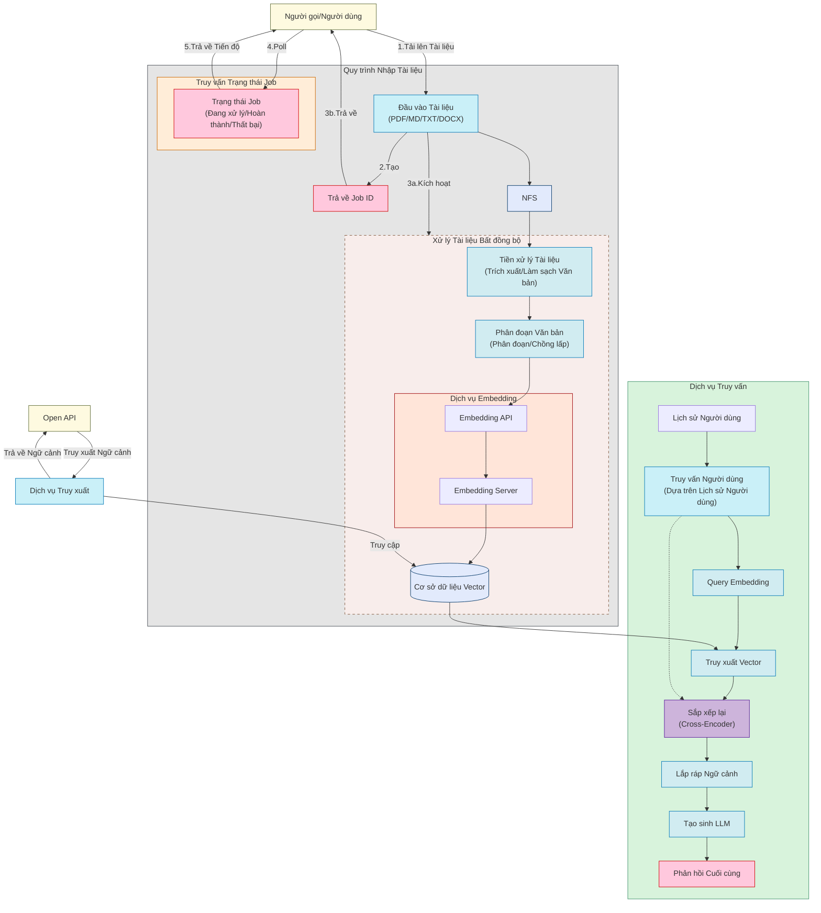
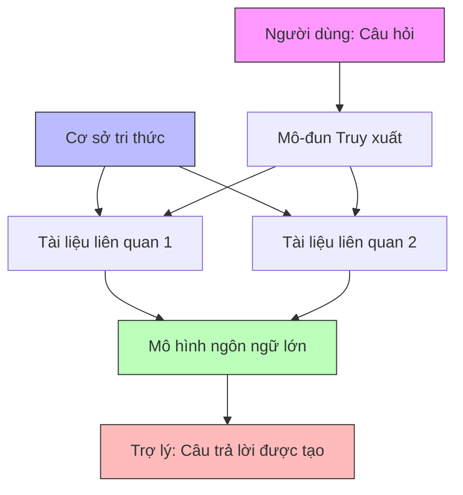
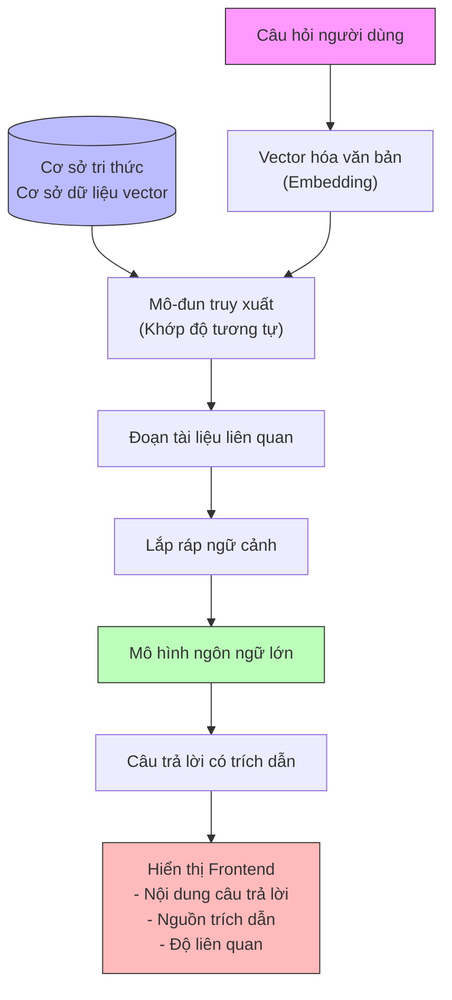

# Hướng dẫn từ cơ bản: Cách xây dựng hệ thống QA cơ sở tri thức với RAG (Retrieval-Augmented Generation)

## Lời mở đầu

Năm nay sắp kết thúc, dự án này được khởi động vào tháng 1 năm 2025 trong thời gian rảnh rỗi như một dự án mang tính giáo dục.

Mục đích chính là hy vọng có thể không phụ thuộc vào các cơ sở hạ tầng lớn khác, kết hợp kinh nghiệm từ nhiều dự án RAG,

sử dụng các công cụ có sẵn trong tay mọi người, thông qua việc chạy thành công một dự án cơ sở tri thức RAG toàn diện, để giúp nhiều bạn học tập hơn hiểu và làm quen với RAG và cơ sở tri thức.

Vì vậy trong dự án này, bạn hiện tại sẽ chưa thấy nhiều chi tiết về RAG, ví dụ như truy xuất đa đường, HyDE, viết lại Query và các khả năng khác (tất nhiên, tôi thấy các bạn có khả năng trong cộng đồng đã đang giúp thực hiện những khả năng này).

Sơ đồ quy trình dự án:

## 1. Hiểu về RAG: Tại sao cần "Truy xuất + Tạo sinh"

### 1.1 RAG là gì

RAG là viết tắt của Retrieval-Augmented Generation, dịch sang tiếng Việt là "Tạo sinh Tăng cường Truy xuất". Đây là một giải pháp kỹ thuật kết hợp hệ thống truy xuất và mô hình AI tạo sinh, bao gồm hai bước cốt lõi:

1. Truy xuất (Retrieval): Dựa trên câu hỏi người dùng nhập vào, truy xuất các tài liệu hoặc đoạn thông tin liên quan từ cơ sở tri thức
2. Tạo sinh (Generation): Sử dụng thông tin liên quan được truy xuất làm ngữ cảnh, kết hợp với câu hỏi người dùng, để mô hình ngôn ngữ lớn tạo ra câu trả lời chính xác

Giải pháp này vừa cho phép mô hình trả lời dựa trên tri thức mới nhất, vừa có thể cung cấp căn cứ tham khảo có thể truy xuất nguồn gốc, giải quyết hiệu quả vấn đề về tính thời sự của tri thức và độ chính xác thực tế của mô hình ngôn ngữ lớn.

Hình dưới đây mô tả quy trình làm việc của RAG trong quá trình đối thoại:

### 1.2 Tại sao cần RAG

Hãy so sánh ưu nhược điểm của ba giải pháp hỏi đáp để hiểu tại sao RAG là lựa chọn tốt hơn:

1. Hỏi đáp truy xuất truyền thống (Retrieval QA)
   - ✅ Độ tin cậy cao: Câu trả lời trực tiếp từ cơ sở tri thức, có nguồn gốc rõ ràng
   - ✅ Tri thức có thể cập nhật: Thêm tài liệu mới là có thể cập nhật tri thức
   - ❌ Tính linh hoạt kém: Chỉ có thể trả về nội dung có sẵn trong cơ sở tri thức
   - ❌ Diễn đạt cứng nhắc: Khó tổ chức câu trả lời bằng ngôn ngữ tự nhiên

2. Hỏi đáp LLM thuần túy
   - ✅ Diễn đạt tự nhiên: Có thể tổ chức câu trả lời bằng ngôn ngữ trôi chảy
   - ✅ Hiểu biết linh hoạt: Có thể hiểu câu hỏi được diễn đạt theo nhiều cách khác nhau
   - ❌ Tri thức cố định: Tri thức chỉ giới hạn trong dữ liệu huấn luyện, không thể cập nhật kịp thời
   - ❌ Độ tin cậy kém: Dễ tạo ra ảo giác, khó xác minh độ chính xác của câu trả lời

3. Giải pháp RAG
   - ✅ Tin cậy và có thể truy xuất nguồn gốc: Câu trả lời dựa trên tài liệu cụ thể được truy xuất
   - ✅ Tri thức có thể cập nhật: Có thể liên tục thêm tri thức mới
   - ✅ Diễn đạt tự nhiên: Tận dụng khả năng ngôn ngữ của LLM để tổ chức câu trả lời
   - ✅ Hiểu biết linh hoạt: Có thể hiểu các hình thức câu hỏi khác nhau
   - ✅ Chi phí có thể kiểm soát: Tiêu thụ chính ở các lần gọi API cần thiết

RAG thông qua việc kết hợp truy xuất và tạo sinh, vừa giữ được độ tin cậy của hỏi đáp truy xuất truyền thống, vừa có được tính linh hoạt và khả năng diễn đạt tự nhiên của LLM. Nó cho phép AI luôn trả lời dựa trên tri thức mới nhất, đáng tin cậy, đồng thời duy trì sự trôi chảy tự nhiên của cuộc đối thoại.

Các tình huống ứng dụng điển hình của RAG:

- Hỏi đáp cơ sở tri thức doanh nghiệp: Giúp doanh nghiệp xây dựng hệ thống cơ sở tri thức nội bộ cho nhân viên hoặc hệ thống hỏi đáp khách hàng đối ngoại.
- Tình huống tham khảo pháp luật, luật lệ, bài báo khoa học: Cần đưa ra câu trả lời có nguồn gốc uy tín hoặc bằng chứng.
- Bất kỳ tình huống nào cần câu trả lời "có thông tin tham chiếu".

## 2. Kiến trúc tổng thể và luồng dữ liệu của hệ thống RAG

### 2.1 Các thành phần cốt lõi

- Cơ sở dữ liệu vector: Dùng để lưu trữ vector của các khối tài liệu sau khi phân đoạn (như ChromaDB, Qdrant).
- Embedding (Vector hóa văn bản): Chuyển đổi văn bản thành vector số có thể so sánh, dạng như [0.1, 0.2, 0.3, 0.4, 0.5]
- Truy xuất (Retrieval): Dựa trên độ tương tự vector của truy vấn người dùng, truy xuất các đoạn tài liệu liên quan nhất.
- Mô hình ngôn ngữ lớn: Kết hợp ngữ cảnh được truy xuất với câu hỏi người dùng, sau đó mô hình (LLM) tạo ra câu trả lời cuối cùng.
- Tạo sinh (Generation) và trích dẫn: Cách nhúng liên kết trích dẫn hoặc chú thích trong câu trả lời, thuận tiện cho người dùng truy xuất nguồn gốc.

### 2.2 Quy trình làm việc điển hình của RAG

1) Người dùng nhập câu hỏi.
2) Vector hóa câu hỏi, sau đó truy xuất các đoạn tài liệu tương tự nhất.
3) Ghép ngữ cảnh được truy xuất với câu hỏi rồi đưa vào LLM.
4) LLM xuất ra câu trả lời có thông tin trích dẫn.
5) Frontend render câu trả lời, tùy chọn hiển thị chi tiết trích dẫn trong giao diện trực quan.

Dưới đây là sơ đồ mô tả quy trình tương tác của các thành phần:

## 3. Xây dựng cơ sở tri thức: Xử lý tài liệu, nhúng, lưu trữ

### 3.1 Tải lên tài liệu và phân khối (Chunking)

#### 3.1.1 Tại sao cần phân khối tài liệu?

Phân khối tài liệu là một bước quan trọng trong hệ thống RAG, chủ yếu vì những lý do sau:

1. Độ chính xác tính toán độ tương tự vector

   - Văn bản quá dài sẽ dẫn đến biểu diễn vector không đủ chính xác
   - Các khối văn bản nhỏ hơn có thể nắm bắt ngữ nghĩa cục bộ tốt hơn
   - Giúp cải thiện độ chính xác của việc truy xuất

2. Giới hạn cửa sổ ngữ cảnh của LLM

   - Độ dài đầu vào của LLM có giới hạn (mặc dù Qwen đã ra mắt cửa sổ ngữ cảnh 1M token 0.0)
   - Cần cắt tài liệu thành kích thước phù hợp để LLM xử lý
   - Tránh mất thông tin do vượt quá giới hạn token

3. Hiệu quả truy xuất và chi phí

   - Các khối văn bản nhỏ hơn thuận tiện cho việc xây dựng chỉ mục chi tiết
   - Chỉ cần truy xuất các đoạn liên quan nhất, tiết kiệm lượng token sử dụng
   - Giảm thông tin không liên quan, cải thiện chất lượng câu trả lời

4. Trích dẫn và truy xuất nguồn gốc (đây là tính năng đặc trưng của RAG)

   - Thuận tiện cho việc định vị nguồn gốc cụ thể của thông tin
   - Có thể đưa ra phạm vi trích dẫn chính xác hơn
   - Giúp người dùng xác minh độ tin cậy của câu trả lời

#### 3.1.2 Các chiến lược phân khối thường gặp

1. Phân khối độ dài cố định

   - Cắt theo số ký tự hoặc số token
   - Thực hiện đơn giản, nhưng có thể cắt đứt đoạn văn có ngữ nghĩa hoàn chỉnh
   - Phù hợp với tài liệu có cấu trúc thống nhất

2. Phân khối ngữ nghĩa

   - Cắt theo đơn vị ngữ nghĩa tự nhiên như đoạn văn, chương
   - Duy trì tính liên kết của ngữ cảnh
   - Cần xem xét cấu trúc cụ thể của tài liệu

3. Phân khối chồng lấp

   - Giữ một mức độ chồng lấp nhất định giữa các khối liền kề
   - Tránh thông tin quan trọng bị cắt đứt
   - Tăng chi phí lưu trữ và tính toán

4. Phân khối đệ quy

   - Trước tiên chia thành khối lớn rồi mới chia nhỏ
   - Duy trì cấu trúc phân cấp
   - Phù hợp với xử lý tài liệu dài

Việc chọn chiến lược phân khối phù hợp cần xem xét:

- Loại và cấu trúc của tài liệu
- Đặc tính của cơ sở dữ liệu vector
- Kích thước cửa sổ ngữ cảnh của LLM
- Cân bằng giữa hiệu quả truy xuất và chi phí

Ví dụ nếu là markdown, có thể phân khối theo đoạn văn, nếu là tài liệu thông thường, có thể phân khối theo chương.

### 3.2 Vector hóa văn bản (Embedding)

Vector hóa văn bản là quá trình chuyển đổi văn bản ngôn ngữ tự nhiên thành vector số trong không gian vector nhiều chiều. Việc chuyển đổi này cho phép chúng ta:

- Sử dụng phương pháp toán học để tính toán độ tương tự ngữ nghĩa giữa các văn bản
- Thực hiện tìm kiếm độ tương tự hiệu quả trong không gian vector
- Giữ lại thông tin ngữ nghĩa và mối quan hệ ngữ cảnh của văn bản

Các mô hình vector hóa văn bản thường dùng bao gồm:

1. OpenAI Embeddings

   - Mô hình text-embedding-ada-002
   - Đầu ra vector 1536 chiều
   - Áp dụng cho tiếng Anh và nhiều ngôn ngữ khác
   - Khả năng biểu đạt ngữ nghĩa mạnh

2. Sentence Transformers

   - Bộ mã hóa cấp câu mã nguồn mở
   - Hỗ trợ đa ngôn ngữ
   - Có thể tinh chỉnh theo tình huống
   - Hiệu quả tính toán cao

Trong RAG Web UI, chủ yếu sử dụng mô hình text-embedding-ada-002 của OpenAI.

### 3.3 Cơ sở dữ liệu vector

Sau khi Embedding văn bản, cần lưu trữ vector vào cơ sở dữ liệu vector để phục vụ cho việc truy xuất và tính toán độ tương tự sau này.

Trong RAG Web UI, chủ yếu sử dụng ChromaDB làm cơ sở dữ liệu vector, đồng thời hỗ trợ sử dụng mô hình Factory, hỗ trợ nhiều cơ sở dữ liệu vector, ví dụ:

1. ChromaDB
2. Qdrant
3. Milvus
4. Faiss
5. Annoy
6. Pinecone
7. Zilliz

Ngoài việc lưu trữ vector, cơ sở dữ liệu vector còn cần mang theo một số thông tin meta (nguồn tài liệu, vị trí đoạn văn, v.v.) để thuận tiện tra cứu.

## 4. Truy xuất và sắp xếp lại: Cung cấp ngữ cảnh liên quan nhất cho mô hình lớn

### 4.1 Tìm kiếm độ tương tự (Similarity Search)

Các phương pháp đo độ tương tự thường dùng: độ tương tự cosine, khoảng cách vector (khoảng cách Euclidean), v.v.

ChromaDB hỗ trợ nhiều phương pháp tính toán độ tương tự:

1. Cosine Similarity (Độ tương tự cosine)

   - Tính toán giá trị cosine của góc giữa hai vector
   - Phạm vi giá trị [-1,1], càng gần 1 càng tương tự
   - Không bị ảnh hưởng bởi độ dài vector, chỉ quan tâm đến hướng
   - Công thức tính: cos(θ) = (A·B)/(||A||·||B||)

2. L2 Distance (Khoảng cách Euclidean)

   - Tính toán khoảng cách đường thẳng giữa hai vector
   - Giá trị càng nhỏ càng tương tự
   - Bị ảnh hưởng bởi độ dài vector
   - Công thức tính: d = √(Σ(ai-bi)²)

3. IP (Inner Product, Tích vô hướng)

   - Nhân các vị trí tương ứng của hai vector rồi tính tổng
   - Giá trị càng lớn càng tương tự
   - Bị ảnh hưởng bởi độ dài vector
   - Công thức tính: IP = Σ(ai×bi)

ChromaDB mặc định sử dụng Cosine Similarity, đây cũng là phương pháp tính toán độ tương tự thường dùng nhất, vì:

- Tính toán đơn giản hiệu quả
- Không bị ảnh hưởng bởi kích thước tuyệt đối của vector
- Hiệu quả tốt cho tính toán độ tương tự ngữ nghĩa văn bản
- Kết quả dễ giải thích và chuẩn hóa

## 5. Tổng kết và bước tiếp theo

Toàn bộ dự án đến đây là kết thúc. Trong toàn bộ dự án này, chúng ta đã hiểu được quy trình ứng dụng cụ thể của RAG trong hỏi đáp cơ sở tri thức thông qua một ví dụ thực hiện kỹ thuật hoàn chỉnh.

Nếu bạn cần Ask Me Anything, có thể liên hệ tôi thông qua [Issue](https://github.com/rag-web-ui/rag-web-ui/issues).

Các hướng bạn có thể nghiên cứu sâu hơn:

- Truy xuất đa đường (hợp nhất kết quả truy xuất từ nhiều cơ sở dữ liệu hoặc các điểm quan tâm khác nhau)
- RAG + Cross-encoder re-ranking để cải thiện độ chính xác câu trả lời
- Đối thoại đa vòng văn bản dài (bộ nhớ ngữ cảnh / Conversation Memory)

Tài liệu tham khảo:
- [Trang web chính thức LangChain](https://python.langchain.com/)  
- [ChromaDB](https://docs.trychroma.com/)  
- [Giới thiệu OpenAI Embeddings](https://platform.openai.com/docs/guides/embeddings) 
